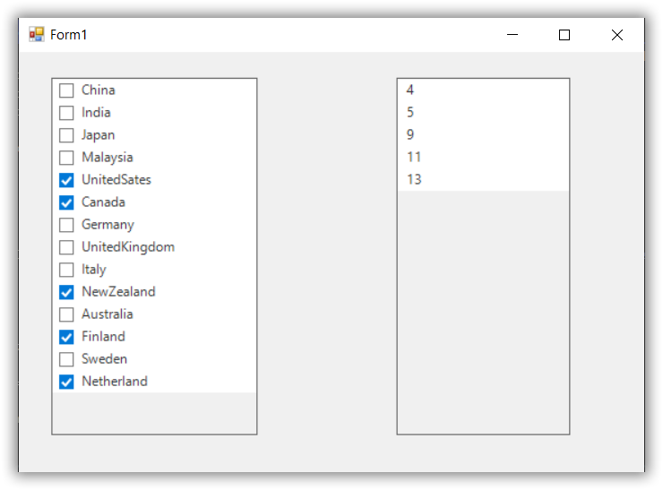

# How to Get Checked Items Indexes in SfListView
This example demonstrates how to retrieve the indexes of checked items in the Syncfusion SfListView control for Windows Forms. The SfListView supports checkboxes, allowing users to select multiple items. In many real-world applications, it’s useful to know not just which items are selected, but also their positions (indexes) within the list.

## Overview
To achieve this, the example uses the CheckedItems collection in combination with the DisplayItems.IndexOf() method. By iterating through the items in the view and comparing them with the checked items, you can determine the index of each selected item and store it in a separate collection.

## Implementation
- Enable checkboxes in SfListView using ShowCheckBoxes = true.
- Loop through the View.Items and compare each with the CheckedItems.
- Use DisplayItems.IndexOf() to get the index of each checked item.
- Store the indexes in an ObservableCollection<int> for further use.
- Works seamlessly with MVVM patterns in WinForms.

## How It Works
- CheckedItems gives you the list of selected items.
- DisplayItems.IndexOf() returns the position of an item in the current view.
- By iterating through CheckedItems, you can build a list of indexes for further processing.
- The example also displays the indexes in a second SfListView for demonstration.

## Code Example
### ListView Declaration
```C#
private void InitializeComponent()
{
ListView1 = new Syncfusion.WinForms.ListView.SfListView();
    this.sfListView2 = new Syncfusion.WinForms.ListView.SfListView();
    this.SuspendLayout();
    // 
    // sfListView1
    // 
    this.sfListView1.Location = new System.Drawing.Point(33, 112);
    this.sfListView1.Name = "sfListView1";
    this.sfListView1.Size = new System.Drawing.Size(244, 392);
    this.sfListView1.TabIndex = 0;
    // 
    // sfListView2
    // 
    this.sfListView2.Location = new System.Drawing.Point(331, 112);
    this.sfListView2.Name = "sfListView2";
    this.sfListView2.Size = new System.Drawing.Size(206, 392);
    this.sfListView2.TabIndex = 2;
    // 
    // Form1
    // 
    this.ClientSize = new System.Drawing.Size(633, 589);
    this.Controls.Add(this.sfListView2);
    this.Controls.Add(this.sfListView1);
    this.StartPosition = FormStartPosition.CenterScreen;
    this.Text = "Get Checked Item Indexes";
    this.ResumeLayout(false);
}
```

### Retrieve Checked Item Indexes and Display in Another SfListView
```C#
public partial class Form1 : Form
{
    ObservableCollection<CountryInfo> countryInfoCollection = new ObservableCollection<CountryInfo>();
    ObservableCollection<int> checkedIndexes = new ObservableCollection<int>();

    public Form1()
    {
        InitializeComponent();
        sfListView1.ShowCheckBoxes = true;
        sfListView1.DataSource = GetDataSource();
        sfListView1.ItemChecked += SfListView1_ItemChecked;

        sfMode = Syncfusion.WinForms.ListView.Enums.CheckBoxSelectionMode.CheckOnItemClick;
        sfListView1.DisplayMember = "CountryName";

        ObservableCollection<CountryInfo> GetDataSource()
        {
            countryInfoCollection.Add(new CountryInfo() { CountryName = "China", Continent = "Asia" });
            countryInfoCollection.Add(new CountryInfo() { CountryName = "India", Continent = "Asia" });
            countryInfoCollection.Add(new CountryInfo() { CountryName = "Japan", Continent = "Asia" });
            countryInfoCollection.Add(new CountryInfo() { CountryName = "Malaysia", Continent = "Asia" });
            countryInfoCollection.Add(new CountryInfo() { CountryName = "UnitedSates", Continent = "Asia" });
            countryInfoCollection.Add(new CountryInfo() { CountryName = "Canada", Continent = "Asia" });
            countryInfoCollection.Add(new CountryInfo() { CountryName = "Germany", Continent = "Asia" });
            countryInfoCollection.Add(new CountryInfo() { CountryName = "UnitedKingdom", Continent = "Asia" });
            countryInfoCollection.Add(new CountryInfo() { CountryName = "Italy", Continent = "Asia" });
            countryInfoCollection.Add(new CountryInfo() { CountryName = "NewZealand", Continent = "Asia" });
            countryInfoCollection.Add(new CountryInfo() { CountryName = "Australia", Continent = "Asia" });
            countryInfoCollection.Add(new CountryInfo() { CountryName = "Finland", Continent = "Asia" });
            countryInfoCollection.Add(new CountryInfo() { CountryName = "Sweden", Continent = "Asia" });
            countryInfoCollection.Add(new CountryInfo() { CountryName = "Netherland", Continent = "Asia" });

            return countryInfoCollection;
        }
    }

    private void SfListView1_ItemChecked(object sender, Syncfusion.WinForms.ListView.Events.ItemCheckedEventArgs e)
    {
        checkedIndexes.Clear();
        foreach (var allItems in sfListView1.View.Items)
        {
            in sfListView1.CheckedItems)
            {
                if (allItems == checkedItem)
                {
                    checkedIndexes.Add(sfListView1.View.DisplayItems.IndexOf(allItems));
                }
            }
        }
        sfListView2.DataSource = checkedIndexes;
    }
}

public class CountryInfo
{
    public string CountryName { get; set; }
    public string Continent { get; set; }
}
```

## Screenshot

